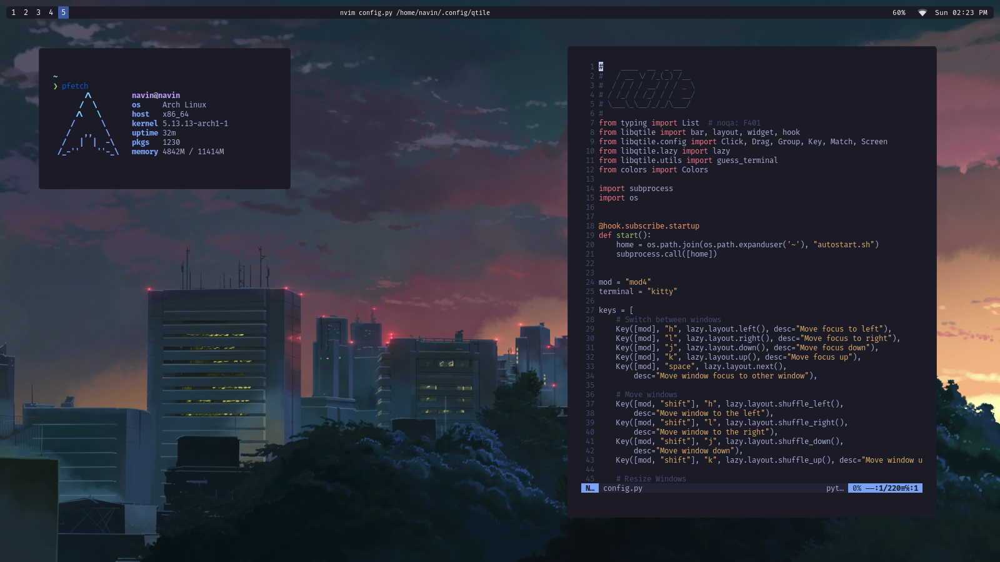

# Dots for linux


### This contains configs for

- wallpapers
- alacritty
- picom
- qtile
- rofi
- dunst
- autostart script
- neovim config

#### Sync config

```bash
sync.sh
```

#### Restore config

```bash
restore.sh
```





